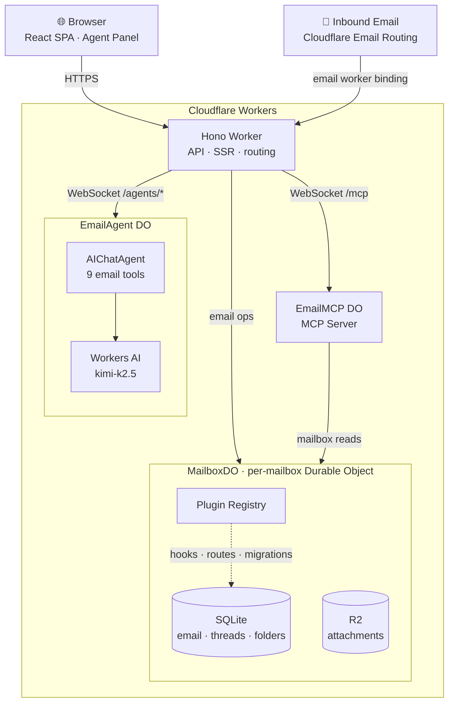

<div align="center">
  <h1>Agentic Inbox</h1>
  <p><em>A self-hosted email client with an AI agent, running entirely on Cloudflare Workers</em></p>
  <p>
    <a href="https://github.com/darklordVirtual/agentic-inbox/actions/workflows/deploy.yml">
      
    </a>
  </p>
</div>

Agentic Inbox lets you send, receive, and manage emails through a modern web interface -- all powered by your own Cloudflare account. Incoming emails arrive via [Cloudflare Email Routing](https://developers.cloudflare.com/email-routing/), each mailbox is isolated in its own [Durable Object](https://developers.cloudflare.com/durable-objects/) with a SQLite database, and attachments are stored in [R2](https://developers.cloudflare.com/r2/).

An **AI-powered Email Agent** can read your inbox, search conversations, and draft replies -- built with the [Cloudflare Agents SDK](https://developers.cloudflare.com/agents/) and [Workers AI](https://developers.cloudflare.com/workers-ai/).


Read the blog post to learn more about Cloudflare Email Service and how to use it with the Agents SDK, MCP, and from the Wrangler CLI: [Email for Agents](https://blog.cloudflare.com/email-for-agents/).

## Deploy

### Option A — One-click (fastest, no terminal needed)

[](https://deploy.workers.cloudflare.com/?url=https://github.com/darklordVirtual/agentic-inbox)

Cloudflare provisions R2, Durable Objects, and Workers AI automatically. You'll be prompted for your **domain** (e.g. `example.com`).

After the button deploy completes (~2 min), two things remain in the dashboard:
1. **Email Routing** — your domain → Email Routing → add a **catch-all** rule → action: *Send to a Worker* → `agentic-inbox`
2. **Cloudflare Access** — Workers & Pages → `agentic-inbox` → Settings → Domains & Routes → **Enable Access**, then copy `POLICY_AUD` and `TEAM_DOMAIN` to Worker secrets via Settings → Variables & Secrets

Done. Visit the Worker URL and create a mailbox.

---

### Option B — GitHub Actions CI/CD (auto-deploy on every push)

Requires: [wrangler CLI](https://developers.cloudflare.com/workers/wrangler/install-and-update/) · [GitHub CLI](https://cli.github.com)

```bash
./scripts/setup.sh
```

The script auto-detects your repo from `git remote`, logs you in to Cloudflare and GitHub, validates your API token against the Cloudflare API before saving it, sets all GitHub Secrets and Variables, and triggers the first deploy. No copy-pasting account IDs manually.

After the first deploy turns green, configure Email Routing and Cloudflare Access in the dashboard, then:

```bash
./scripts/setup.sh --access
```

This prompts for the two Access values and re-deploys. Every subsequent `git push main` deploys automatically.

### Troubleshooting

| Error | Fix |
|-------|-----|
| `Invalid or expired Access token` | Re-run `./scripts/setup.sh --access` with fresh values from the Access modal |
| `Cloudflare Access must be configured in production` | Run `./scripts/setup.sh --access` |
| `API token verification failed` | The token scope is wrong — recreate with the **Edit Cloudflare Workers** template |


## Features

- **Full email client** — Send and receive emails via Cloudflare Email Routing with a rich text composer, reply/forward threading, folder organization, search, and attachments
- **Per-mailbox isolation** — Each mailbox runs in its own Durable Object with SQLite storage and R2 for attachments
- **Built-in AI agent** — Side panel with 9 email tools for reading, searching, drafting, and sending
- **Auto-draft on new email** — Agent automatically reads inbound emails and generates draft replies, always requiring explicit confirmation before sending
- **Configurable and persistent** — Custom system prompts per mailbox, persistent chat history, streaming markdown responses, and tool call visibility

## Stack

- **Frontend:** React 19, React Router v7, Tailwind CSS, Zustand, TipTap, `@cloudflare/kumo`
- **Backend:** Hono, Cloudflare Workers, Durable Objects (SQLite), R2, Email Routing
- **AI Agent:** Cloudflare Agents SDK (`AIChatAgent`), AI SDK v6, Workers AI (`@cf/moonshotai/kimi-k2.5`), `react-markdown` + `remark-gfm`
- **Auth:** Cloudflare Access JWT validation (required outside local development)

## Local development

```bash
npm install
npm run dev
```

No credentials needed for local development — Cloudflare Access is bypassed automatically in the local dev server.

## Prerequisites

- Cloudflare account with a domain
- [Email Routing](https://developers.cloudflare.com/email-routing/) enabled for receiving
- [Email Service](https://developers.cloudflare.com/email-service/) enabled for sending
- [Workers AI](https://developers.cloudflare.com/workers-ai/) enabled (for the agent)
- [Cloudflare Access](https://developers.cloudflare.com/cloudflare-one/policies/access/) configured for deployed/shared environments (required in production)

Any user who passes the shared Cloudflare Access policy can access all mailboxes in this app by design. This includes the MCP server at `/mcp` -- external AI tools (Claude Code, Cursor, etc.) connected via MCP can operate on any mailbox by passing a `mailboxId` parameter. There is no per-mailbox authorization; the Cloudflare Access policy is the single trust boundary.

## Architecture

### System overview



### Plugin system

```mermaid
flowchart LR
    subgraph Contract["InboxPlugin interface  (workers/plugins/types.ts)"]
        direction TB
        M["manifest\nid · name · version"]
        Mig["migrations\nSQL DDL per table"]
        Routes["registerRoutes(app)\nHono sub-router"]
        H1["onEmailReceived(ctx, payload)\nhook — fires after every inbound email"]
        H2["onSyncRequest(ctx)\nhook — fires on manual sync"]
    end

    subgraph DC["Debt Control  (plugins/debt-control/)"]
        direction TB
        CL["Classification Engine\n9 document kinds · confidence score"]
        CE["Case Engine\nfind-or-create · priority scoring"]
        LE["Legality Engine\n6 deterministic rules"]
        RE["Reconciliation Engine\nbank transaction matching"]
        OE["Objection Engine\n4 draft templates"]
        BP["Bank Providers\nSpareBank 1 API · CSV"]
    end

    subgraph Storage["Per-mailbox SQLite  (dc_ prefix)"]
        direction TB
        T1["dc_cases"]
        T2["dc_documents"]
        T3["dc_findings"]
        T4["dc_transactions · dc_payment_matches"]
        T5["dc_settings"]
    end

    Contract -->|"implemented by"| DC
    DC       -->|"reads / writes"| Storage
```



## Plugins

Agentic Inbox supports a plugin architecture that extends the core mailbox with domain-specific logic, storage, API routes, and UI — all isolated per plugin.

### Installed plugins

| Plugin | Version | Description |
|--------|---------|-------------|
| [Debt Control](#debt-control-plugin) | 1.0.0 | Mailbox-native debtor operations engine |

---

### Debt Control plugin

**Location:** [`plugins/debt-control/`](plugins/debt-control/)

Classifies incoming debt-related emails (invoices, reminders, final notices, bailiff letters), links them to cases, reconciles bank transactions, runs deterministic legality checks, and suggests draft objections.

#### Features

- **Email classification** — 9 document types detected via regex rules with confidence scoring
- **Case management** — Automatic case creation/linking per creditor reference; priority scoring based on document kind, days until due, and amount
- **Legality engine** — 6 deterministic rules: already paid, missing legal basis, short deadline, excessive fees, fragmentation detection
- **Bank reconciliation** — Matches bank transactions against open cases using weighted scoring (amount + date + reference + counterparty). Never auto-confirms.
- **Objection drafting** — 4 objection templates generated from legality findings
- **Bank providers** — SpareBank 1 Transactions API + CSV file import fallback

#### UI routes

| Route | Description |
|-------|-------------|
| `/mailbox/:id/debt` | Priority board — open cases by urgency |
| `/mailbox/:id/debt/cases/:caseId` | Case detail — documents, findings, payment matches, suggested actions |
| `/mailbox/:id/debt/settings` | Plugin settings |
| `/mailbox/:id/debt/bank` | Bank provider configuration |

#### API routes (all under `/api/v1/mailboxes/:mailboxId/api/plugins/debt-control`)

| Method | Path | Description |
|--------|------|-------------|
| `GET/PUT` | `/settings` | Plugin settings |
| `GET` | `/bank/status` | Bank provider connection status |
| `POST` | `/bank/sync` | Trigger transaction sync |
| `GET` | `/cases` | List all cases |
| `GET` | `/cases/:id` | Case detail |
| `POST` | `/cases/:id/reconcile` | Reconcile case against transactions |
| `POST` | `/cases/:id/draft` | Generate objection draft |

#### Required secrets (SpareBank 1 only)

```bash
wrangler secret put SB1_CLIENT_ID
wrangler secret put SB1_ACCESS_TOKEN
```

See [deployment-recipes/sparebank1-setup.md](deployment-recipes/sparebank1-setup.md) for full API registration instructions and [deployment-recipes/cloudflare-secrets.md](deployment-recipes/cloudflare-secrets.md) for the complete secrets reference.

---

### Adding a new plugin

A plugin is a TypeScript object implementing the `InboxPlugin` interface from [`workers/plugins/types.ts`](workers/plugins/types.ts):

```ts
import type { InboxPlugin } from "../../workers/plugins/types";

export const myPlugin: InboxPlugin = {
  manifest: {
    id: "my-plugin",
    name: "My Plugin",
    version: "1.0.0",
  },

  // Optional: SQL migrations run once per Durable Object
  migrations: [
    {
      id: "my_plugin_001_initial",
      sql: `CREATE TABLE IF NOT EXISTS mp_items (id TEXT PRIMARY KEY)`,
    },
  ],

  // Optional: mount Hono routes under /api/v1/mailboxes/:mailboxId/api/plugins/my-plugin/
  registerRoutes(app) {
    app.get("/hello", (c) => c.json({ ok: true }));
  },

  // Optional: called after every inbound email is stored
  async onEmailReceived(ctx, payload) {
    // ctx.sql — raw SqlStorage for this mailbox's Durable Object
    // payload.emailId, payload.subject, payload.bodyText, payload.from
  },

  // Optional: called when a manual sync is requested
  async onSyncRequest(ctx) {},
};
```

**Registration:**

1. Create your plugin under `plugins/<your-plugin>/index.ts`
2. Import and register it in [`workers/plugins/register.ts`](workers/plugins/register.ts):

```ts
import { pluginRegistry } from "./loader";
import { myPlugin } from "../../plugins/my-plugin";

pluginRegistry.register(myPlugin);
```

3. Add UI routes in [`app/routes.ts`](app/routes.ts) if needed
4. Add `"plugins/**/*"` is already in `tsconfig.cloudflare.json` — no extra config required

---

### Changelog

| Date | Plugin | Change |
|------|--------|--------|
| 2026-04-23 | Debt Control 1.0.0 | Initial implementation — classification, cases, legality, bank reconciliation, SpareBank 1 + CSV providers, full UI |
| 2026-04-23 | Core | Plugin architecture added (`workers/plugins/`) |

---

## License

Apache 2.0 -- see [LICENSE](LICENSE).
