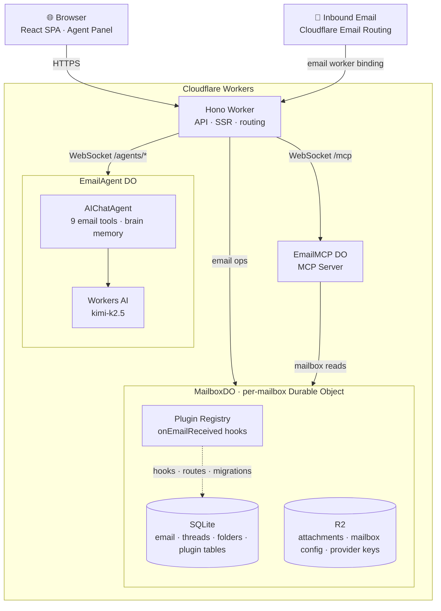

```mermaid
flowchart LR
    subgraph Contract["InboxPlugin interface  (workers/plugins/types.ts)"]
        direction TB
        M["manifest\nid · name · version · settingsSchema"]
        Mig["migrations\nSQL DDL per table"]
        Routes["registerRoutes(app)\nHono sub-router"]
        H1["onEmailReceived(payload, ctx)\nhook — fires after every inbound email"]
        H2["onSyncRequest(ctx)\nhook — fires on manual sync"]
    end

    subgraph DC["Debt Control  (plugins/debt-control/)"]
        direction TB
        CL["Classification Engine\n9 document kinds · confidence score"]
        CE["Case Engine\nfind-or-create · priority scoring"]
        LE["Legality Engine\n6 deterministic rules"]
        RE["Reconciliation Engine\nbank transaction matching"]
        OE["Objection Engine\n4 draft templates"]
        BP["Bank Providers\nSpareBank 1 API · CSV"]
    end

    subgraph AG["AI Agents  (plugins/agents/)"]
        direction TB
        AR["Agent Runner\nrole dispatch · guardrails"]
        GL["Guardrail Engine\nrate limits · token budgets · no-reply guard"]
        SR["Sender Reports\nAI-generated identity profiles"]
        RO["9 Roles\nspam_guard · router · researcher · responder\nsupport · marketing · scheduler · summarizer · custom"]
    end

    subgraph Storage["Per-mailbox SQLite tables"]
        DC --> |"dc_ prefix"| T1["dc_cases · dc_documents\ndc_findings · dc_transactions\ndc_payment_matches · dc_settings"]
        AG --> |"ag_ prefix"| T2["ag_agents · ag_usage\nag_reports · ag_rate_buckets"]
    end

    Contract -->|"implemented by"| DC
    Contract -->|"implemented by"| AG
```

<div align="center">
  <h1>Agentic Inbox</h1>
  <p><em>A self-hosted email client with an AI agent, running entirely on Cloudflare Workers</em></p>
  <p>
    <a href="https://github.com/cloudflare/agentic-inbox">
      
    </a>
    <a href="https://github.com/notapersona/agentic-inbox/actions/workflows/deploy.yml">
      
    </a>
  </p>
</div>

> **⚠ This is a fork of [cloudflare/agentic-inbox](https://github.com/cloudflare/agentic-inbox).**
> See the [Fork differences](#fork-differences--credits) section for a complete list of what has been added and changed.

---

Agentic Inbox lets you send, receive, and manage emails through a modern web interface — all powered by your own Cloudflare account. Incoming emails arrive via [Cloudflare Email Routing](https://developers.cloudflare.com/email-routing/), each mailbox is isolated in its own [Durable Object](https://developers.cloudflare.com/durable-objects/) with a SQLite database, and attachments are stored in [R2](https://developers.cloudflare.com/r2/).

An **AI-powered Email Agent** can read your inbox, search conversations, and draft replies — built with the [Cloudflare Agents SDK](https://developers.cloudflare.com/agents/) and [Workers AI](https://developers.cloudflare.com/workers-ai/).


Read the original blog post: [Email for Agents](https://blog.cloudflare.com/email-for-agents/).

---

## Fork differences & credits

This fork is maintained by **Stian Skogbrott** and extends the official Cloudflare project with production-ready plugins and UI improvements that are **not part of the upstream repository**.

### What is different from the official Cloudflare project

| Area | Upstream (`cloudflare/agentic-inbox`) | This fork |
|------|---------------------------------------|-----------|
| **AI Agents plugin** | Not included | ✅ Full plugin with 9 roles, guardrails, token budgets, sender reports |
| **Debt Control plugin** | Not included | ✅ Full debt operations engine — classification, cases, legality, bank reconciliation |
| **SpareBank 1 integration** | Not included | ✅ SpareBank 1 Transactions API provider + CSV fallback |
| **AI provider support** | Basic Workers AI | ✅ 7 providers: Cloudflare, OpenAI, Anthropic, OpenRouter, Groq, Together AI, Google AI |
| **Model selection** | Single model | ✅ UI for selecting from all available models per provider, with cost/context info |
| **Agent modal** | Not included | ✅ Tabbed modal: Identity / Model / Guardrails |
| **Plugin settings UI** | Not included | ✅ Expandable model tables, key management, enable/disable toggles |
| **Debt Control UI** | Not included | ✅ Full kumo design system: settings, bank config, SpareBank 1 setup guide |

### What is the same

The core mailbox engine, Durable Object architecture, Email Routing integration, MCP server, rich text composer, threading, full-text search, attachments, Cloudflare Access auth, and the interactive AI agent side panel are all **unchanged from the upstream project** and remain the work of the Cloudflare team.

### Author of fork additions

All plugins, the extended provider system, and the UI improvements in this fork were written by **Stian Skogbrott**.

---

## Deploy

### Option A — One-click (fastest, no terminal needed)

[](https://deploy.workers.cloudflare.com/?url=https://github.com/notapersona/agentic-inbox)

Cloudflare provisions R2, Durable Objects, and Workers AI automatically. You'll be prompted for your **domain** (e.g. `example.com`).

After the button deploy completes (~2 min), two things remain in the dashboard:
1. **Email Routing** — your domain → Email Routing → add a **catch-all** rule → action: *Send to a Worker* → `agentic-inbox`
2. **Cloudflare Access** — Workers & Pages → `agentic-inbox` → Settings → Domains & Routes → **Enable Access**, then copy `POLICY_AUD` and `TEAM_DOMAIN` to Worker secrets via Settings → Variables & Secrets

Done. Visit the Worker URL and create a mailbox.

---

### Option B — GitHub Actions CI/CD (auto-deploy on every push)

This is the recommended approach for ongoing development. Every push to `main` triggers a full build, type-check, and deploy via the [`.github/workflows/deploy.yml`](.github/workflows/deploy.yml) workflow.

#### Step 1 — Fork and clone

```bash
git clone https://github.com/your-username/agentic-inbox.git
cd agentic-inbox
npm install
```

#### Step 2 — Run the setup script

```bash
./scripts/setup.sh
```

The script:
- Logs you in to **Cloudflare** and **GitHub**
- Validates your Cloudflare API token against the Cloudflare API before saving
- Sets all required **GitHub Secrets and Variables** automatically
- Triggers the first deploy

No copy-pasting account IDs manually.

#### Step 3 — Configure Cloudflare Access (production only)

After the first deploy turns green, enable Cloudflare Access in the dashboard:

1. Go to **Workers & Pages → your worker → Settings → Domains & Routes**
2. Click **Enable Cloudflare Access**
3. Create or attach an Access application — note the **Audience tag** and your **Team domain**
4. Run:

```bash
./scripts/setup.sh --access
```

This prompts for the two Access values and re-deploys. Every subsequent `git push main` deploys automatically.

---

## GitHub Actions — Required settings

The deploy workflow reads secrets and variables from your GitHub repository. These must be set **before the first deploy** (the setup script handles this — manual instructions below if needed).

### Where to find these settings in GitHub

Go to your repository → **Settings** → left sidebar:
- **Secrets and variables → Actions → Secrets tab** — for sensitive values (API tokens, keys)
- **Secrets and variables → Actions → Variables tab** — for non-sensitive configuration (domain names)

---

### Required GitHub Secrets

These are **encrypted** in GitHub and passed to the Wrangler deploy action. Never commit these to source code.

| Secret name | Where to get it | When needed |
|-------------|----------------|------------|
| `CLOUDFLARE_API_TOKEN` | Cloudflare dashboard → **My Profile → API Tokens → Create Token** → use the *Edit Cloudflare Workers* template | Always — required for every deploy |
| `CLOUDFLARE_ACCOUNT_ID` | Cloudflare dashboard → right sidebar on any Workers page under **Account ID** | Always — required for every deploy |
| `POLICY_AUD` | Cloudflare Access → your application → **Overview** → copy the **Audience tag** (a 64-char hex string) | After enabling Cloudflare Access |
| `TEAM_DOMAIN` | Cloudflare Access → **Settings** → your Access team domain (e.g. `https://yourteam.cloudflareaccess.com`) | After enabling Cloudflare Access |

To set a secret manually:
1. GitHub repo → **Settings → Secrets and variables → Actions**
2. Click **New repository secret**
3. Enter the name and value, click **Add secret**

---

### Required GitHub Variables

Variables are **not encrypted** and suitable for non-sensitive configuration.

| Variable name | Example value | When needed |
|---------------|--------------|------------|
| `DOMAINS` | `example.com` or `example.com,mail.example.com` | Always — set to your Cloudflare-managed domain(s). If not set, falls back to `example.com`. |

To set a variable:
1. GitHub repo → **Settings → Secrets and variables → Actions**
2. Click the **Variables** tab
3. Click **New repository variable**
4. Name: `DOMAINS`, Value: your domain(s), click **Add variable**

---

### How the workflow uses these values

```yaml
# From .github/workflows/deploy.yml

- name: Deploy to Cloudflare Workers
  uses: cloudflare/wrangler-action@v3
  with:
    apiToken: ${{ secrets.CLOUDFLARE_API_TOKEN }}      # ← GitHub Secret
    accountId: ${{ secrets.CLOUDFLARE_ACCOUNT_ID }}   # ← GitHub Secret
    command: deploy --var "DOMAINS:${{ vars.DOMAINS || 'example.com' }}"
    #                               ↑ GitHub Variable

- name: Apply Access secrets (if configured)
  env:
    CLOUDFLARE_API_TOKEN: ${{ secrets.CLOUDFLARE_API_TOKEN }}
    CLOUDFLARE_ACCOUNT_ID: ${{ secrets.CLOUDFLARE_ACCOUNT_ID }}
    POLICY_AUD: ${{ secrets.POLICY_AUD }}              # ← GitHub Secret (optional)
    TEAM_DOMAIN: ${{ secrets.TEAM_DOMAIN }}            # ← GitHub Secret (optional)
```

The `POLICY_AUD` and `TEAM_DOMAIN` steps are **no-ops** if the secrets are empty — the workflow will succeed without them until you enable Cloudflare Access.

---

### Optional plugin secrets (set via Wrangler, not GitHub)

These are **Cloudflare Worker secrets** set directly via the `wrangler` CLI. They live in the Worker's runtime environment and are not stored in GitHub.

| Secret name | Plugin | Where to get it | How to set |
|-------------|--------|----------------|-----------|
| `SB1_CLIENT_ID` | Debt Control — SpareBank 1 | [developer.sparebank1.no](https://developer.sparebank1.no) → create app → copy Client ID | `wrangler secret put SB1_CLIENT_ID` |
| `SB1_ACCESS_TOKEN` | Debt Control — SpareBank 1 | Same app page → generate Access Token | `wrangler secret put SB1_ACCESS_TOKEN` |

These secrets are only needed if you enable the **SpareBank 1** bank provider in the Debt Control plugin settings. See [deployment-recipes/sparebank1-setup.md](deployment-recipes/sparebank1-setup.md) for the full API registration guide.

For local development, add these to a `.dev.vars` file (already git-ignored):

```ini
# .dev.vars — local only, never commit
SB1_CLIENT_ID=your-client-id
SB1_ACCESS_TOKEN=your-access-token
POLICY_AUD=
TEAM_DOMAIN=
```

---

### Troubleshooting

| Error | Fix |
|-------|-----|
| `Invalid or expired Access token` | Re-run `./scripts/setup.sh --access` with fresh values from the Access modal |
| `Cloudflare Access must be configured in production` | Run `./scripts/setup.sh --access` |
| `API token verification failed` | Token scope is wrong — recreate with the **Edit Cloudflare Workers** template |
| Deploy succeeds but app shows wrong domain | Check that the `DOMAINS` GitHub Variable is set correctly |
| SpareBank 1 test shows "SB1_CLIENT_ID not set" | Run `wrangler secret put SB1_CLIENT_ID` and `wrangler secret put SB1_ACCESS_TOKEN` |

---

## Features

- **Full email client** — Send and receive via Cloudflare Email Routing with rich text composer, reply/forward threading, folder management, full-text search, and attachments
- **Per-mailbox isolation** — Each mailbox runs in its own Durable Object with SQLite storage and R2 for attachments
- **Interactive AI agent** — Side panel chat with 9 email tools (list, read, search, draft, move, mark read, thread, attachments, brain memory) powered by Workers AI
- **Auto-draft on arrival** — Agent reads inbound emails and generates draft replies automatically; always awaits human confirmation before sending
- **AI Agents plugin** — Configurable background agents with roles, per-agent guardrails, token budgets, and sender intelligence reports *(fork addition)*
- **Multi-provider AI** — Cloudflare Workers AI (built-in), OpenAI, Anthropic, OpenRouter, Groq, Together AI, Google AI. API keys stored AES-GCM encrypted per-mailbox in R2 *(extended in fork)*
- **Debt Control plugin** — Mailbox-native debt operations engine with email classification, case management, legality checks, bank reconciliation, and objection drafting *(fork addition)*
- **SpareBank 1 integration** — Connects to the SpareBank 1 Transactions API for automated payment reconciliation *(fork addition)*
- **Plugin system** — Extend with domain-specific logic, storage, API routes, and UI; plugins can be enabled/disabled per mailbox at runtime
- **Custom system prompts** — Override the agent system prompt per mailbox; configurable auto-reply toggle
- **Persistent agent memory** — Key-value brain store per mailbox; scoped by `sender`, `instruction`, `preference`, and `loop` (loop-detection built-in)
- **MCP server** — Exposes mailbox operations as MCP tools at `/mcp` for use with Claude Code, Cursor, etc.

## Stack

- **Frontend:** React 19, React Router v7, Tailwind CSS, Zustand, TipTap, `@cloudflare/kumo`
- **Backend:** Hono, Cloudflare Workers, Durable Objects (SQLite), R2, Email Routing
- **AI Agent:** Cloudflare Agents SDK (`AIChatAgent`), AI SDK v6, Workers AI (`@cf/moonshotai/kimi-k2.5`), `react-markdown` + `remark-gfm`
- **Auth:** Cloudflare Access JWT validation (required outside local development)

## Local development

```bash
npm install
npm run dev
```

No credentials needed for local development — Cloudflare Access is bypassed automatically in the local dev server.

## Prerequisites

- Cloudflare account with a domain
- [Email Routing](https://developers.cloudflare.com/email-routing/) enabled for receiving
- [Email Service](https://developers.cloudflare.com/email-service/) enabled for sending
- [Workers AI](https://developers.cloudflare.com/workers-ai/) enabled (for the agent)
- [Cloudflare Access](https://developers.cloudflare.com/cloudflare-one/policies/access/) configured for deployed/shared environments (required in production)

Any user who passes the shared Cloudflare Access policy can access all mailboxes in this app by design. This includes the MCP server at `/mcp` — external AI tools (Claude Code, Cursor, etc.) connected via MCP can operate on any mailbox by passing a `mailboxId` parameter. There is no per-mailbox authorization; the Cloudflare Access policy is the single trust boundary.

## Architecture

### System overview



### API surface

All routes require Cloudflare Access JWT (bypassed in local dev).

| Prefix | Description |
|--------|-------------|
| `GET /api/v1/config` | Configured domains and email addresses |
| `GET/POST /api/v1/mailboxes` | List / create mailboxes |
| `GET/PUT/DELETE /api/v1/mailboxes/:id` | Mailbox settings |
| `GET/POST /api/v1/mailboxes/:id/emails` | List / send emails |
| `POST /api/v1/mailboxes/:id/drafts` | Save draft |
| `GET/PUT/DELETE /api/v1/mailboxes/:id/emails/:msgId` | Read / update / delete email |
| `POST /api/v1/mailboxes/:id/emails/:msgId/move` | Move to folder |
| `POST /api/v1/mailboxes/:id/emails/:msgId/reply` | Reply |
| `POST /api/v1/mailboxes/:id/emails/:msgId/forward` | Forward |
| `GET /api/v1/mailboxes/:id/threads/:threadId` | Full thread |
| `POST /api/v1/mailboxes/:id/threads/:threadId/read` | Mark thread read |
| `GET/POST/PUT/DELETE /api/v1/mailboxes/:id/folders` | Folder CRUD |
| `GET /api/v1/mailboxes/:id/search` | Full-text search |
| `GET /api/v1/mailboxes/:id/emails/:eId/attachments/:aId` | Download attachment |
| `GET /api/v1/mailboxes/:id/plugins` | List plugins with enabled state |
| `PUT /api/v1/mailboxes/:id/plugins/:pluginId` | Enable / disable plugin |
| `GET /api/v1/mailboxes/:id/providers` | List AI providers + key status |
| `PUT /api/v1/mailboxes/:id/providers/:providerId` | Save encrypted API key |
| `DELETE /api/v1/mailboxes/:id/providers/:providerId` | Remove API key |

Plugin routes are mounted under `/api/v1/mailboxes/:id/api/plugins/:pluginId/`.

### Plugin system



---

## Plugins

Agentic Inbox supports a plugin architecture that extends the core mailbox with domain-specific logic, storage, API routes, and UI — all isolated per plugin.

Plugins can be enabled or disabled per mailbox at runtime via **Plugins & Providers** in the sidebar, without redeploying.

> **Note:** The plugins below (`Debt Control` and `AI Agents`) are additions in this fork and are **not official Cloudflare plugins**. They are written and maintained by Stian Skogbrott.

### Installed plugins

| Plugin | Version | Description | Author |
|--------|---------|-------------|--------|
| [Debt Control](#debt-control-plugin) | 1.0.0 | Mailbox-native debtor operations engine | Stian Skogbrott |
| [AI Agents](#ai-agents-plugin) | 1.0.0 | Configurable background agents for automated email processing | Stian Skogbrott |

---

### Debt Control plugin

**Location:** [`plugins/debt-control/`](plugins/debt-control/)

> ⚠ **Not an official Cloudflare plugin.** Written by Stian Skogbrott.

Classifies incoming debt-related emails (invoices, reminders, final notices, bailiff letters), links them to cases, reconciles bank transactions, runs deterministic legality checks, and suggests draft objections.

#### Features

- **Email classification** — 9 document types detected via regex rules with confidence scoring
- **Case management** — Automatic case creation/linking per creditor reference; priority scoring based on document kind, days until due, and amount
- **Legality engine** — 6 deterministic rules: already paid, missing legal basis, short deadline, excessive fees, fragmentation detection
- **Bank reconciliation** — Matches bank transactions against open cases using weighted scoring (amount + date + reference + counterparty). Never auto-confirms.
- **Objection drafting** — 4 objection templates generated from legality findings
- **Bank providers** — SpareBank 1 Transactions API + CSV file import fallback

#### UI routes

| Route | Description |
|-------|-------------|
| `/mailbox/:id/debt` | Priority board — open cases by urgency |
| `/mailbox/:id/debt/cases/:caseId` | Case detail — documents, findings, payment matches, suggested actions |
| `/mailbox/:id/debt/settings` | Plugin settings |
| `/mailbox/:id/debt/bank` | Bank provider configuration |

#### API routes (all under `/api/v1/mailboxes/:mailboxId/api/plugins/debt-control`)

| Method | Path | Description |
|--------|------|-------------|
| `GET/PATCH` | `/settings` | Plugin settings |
| `GET` | `/settings/bank` | Bank provider connection status |
| `POST` | `/settings/bank/test` | Test bank connection |
| `POST` | `/bank/sync` | Trigger transaction sync |
| `GET` | `/cases` | List all cases (optional `?status=`) |
| `GET` | `/cases/:id` | Case detail with documents, findings, matches |
| `POST` | `/cases/:id/reconcile` | Reconcile case against bank transactions |
| `POST` | `/cases/:id/draft-objection` | Generate objection draft |
| `POST` | `/cases/:id/request-more-info` | Draft a request for more information |

#### Required secrets (SpareBank 1 only)

```bash
wrangler secret put SB1_CLIENT_ID
wrangler secret put SB1_ACCESS_TOKEN
```

See [deployment-recipes/sparebank1-setup.md](deployment-recipes/sparebank1-setup.md) for full API registration instructions and [deployment-recipes/cloudflare-secrets.md](deployment-recipes/cloudflare-secrets.md) for the complete secrets reference.

---

### AI Agents plugin

**Location:** [`plugins/agents/`](plugins/agents/)

> ⚠ **Not an official Cloudflare plugin.** Written by Stian Skogbrott.

Configurable background agents that automatically process incoming emails. Each agent has a role, a configured AI model/provider, trigger filters, and guardrails. The processing pipeline runs server-side inside the Durable Object on every inbound email.

#### Agent roles

| Role | Description |
|------|-------------|
| `spam_guard` | Classifies and blocks spam/phishing before other agents run |
| `router` | Analyzes intent and routes to the appropriate agent type |
| `researcher` | Builds sender identity reports stored in the brain |
| `responder` | Drafts (or auto-sends) email replies |
| `support` | Customer support auto-responder with escalation detection |
| `marketing` | Handles outbound marketing campaign replies |
| `scheduler` | Extracts meeting requests and drafts calendar invites |
| `summarizer` | Generates concise thread summaries |
| `custom` | Fully custom system prompt defined by operator |

#### Processing pipeline (per inbound email)

1. **Prompt injection scan** — AI safety check on the email body
2. **Spam guard** — blocks processing if flagged (runs before all other agents)
3. **Researcher** — fire-and-forget sender profiling (non-blocking)
4. **Router** — intent classification (non-blocking)
5. **Remaining agents** — responder, support, marketing, scheduler, summarizer, custom (concurrent)

#### Guardrails (per agent)

| Setting | Default | Description |
|---------|---------|-------------|
| `maxEmailsPerHour` | 20 | Rate limit — stops runaway agents |
| `dailyTokenBudget` | 100,000 | Maximum tokens consumed per day |
| `autoSend` | false | Send without human review (opt-in) |
| `maxAutoSendPerDay` | 10 | Cap on autonomous sends even when autoSend=true |
| `requireSpamCheck` | true | Run spam guard before this agent |

#### UI routes

| Route | Description |
|-------|-------------|
| `/mailbox/:id/agents` | Agent management dashboard — create, edit, enable/disable, delete |
| `/mailbox/:id/plugin-settings` | Plugin toggles + AI provider key management |

#### API routes (all under `/api/v1/mailboxes/:mailboxId/api/plugins/agents`)

| Method | Path | Description |
|--------|------|-------------|
| `GET` | `/` | List all agents with role metadata |
| `POST` | `/` | Create agent |
| `GET` | `/roles` | List available roles with default trigger events |
| `GET` | `/reports` | List recent sender intelligence reports |
| `GET` | `/reports/:emailAddress` | Sender report for a specific address |
| `GET` | `/:agentId` | Get agent detail |
| `PUT` | `/:agentId` | Update agent (name, role, model, guardrails, enabled) |
| `DELETE` | `/:agentId` | Delete agent |
| `GET` | `/:agentId/usage?days=7` | Usage summary (runs, tokens, cost) |

#### AI provider management

All AI providers are managed under `/api/v1/mailboxes/:mailboxId/providers`.

Available providers (fork extends the original with 3 additional providers and many more models):

| Provider | Key required | Notes |
|----------|-------------|-------|
| Cloudflare Workers AI | No | Built-in; free tier included. Default. 8 models. |
| OpenAI | Yes | GPT-4.1, GPT-4.1 mini, GPT-4o, o3, o4-mini, o3-mini |
| Anthropic | Yes | Claude Opus/Sonnet/Haiku 4.5 + Sonnet 3.7 |
| OpenRouter | Yes | One key for 200+ models — 10 curated models listed |
| Groq | Yes | Ultra-low latency inference — 5 models |
| Together AI | Yes | Open-source model hosting — 4 models |
| Google AI | Yes | Gemini 2.5 Pro, 2.5 Flash, 2.0 Flash *(fork addition)* |

API keys are encrypted with AES-256-GCM per mailbox before storage in R2. Keys are never returned to the browser after saving.

---

### Adding a new plugin

A plugin is a TypeScript object implementing the `InboxPlugin` interface from [`workers/plugins/types.ts`](workers/plugins/types.ts):

```ts
import type { InboxPlugin } from "../../workers/plugins/types";

export const myPlugin: InboxPlugin = {
  manifest: {
    id: "my-plugin",
    name: "My Plugin",
    version: "1.0.0",
    description: "What this plugin does",
  },

  // Optional: SQL migrations run once per Durable Object (idempotent)
  migrations: [
    {
      name: "my_plugin_001_initial",
      sql: `CREATE TABLE IF NOT EXISTS mp_items (id TEXT PRIMARY KEY)`,
    },
  ],

  // Optional: mount Hono routes under /api/v1/mailboxes/:mailboxId/api/plugins/my-plugin/
  registerRoutes(app) {
    app.get("/hello", (c) => c.json({ ok: true }));
  },

  // Optional: called after every inbound email is stored
  async onEmailReceived(payload, ctx) {
    // ctx.sql    — raw SqlStorage for this mailbox's Durable Object
    // ctx.env    — Cloudflare env bindings (AI, BUCKET, secrets, ...)
    // ctx.mailboxId — e.g. "user@example.com"
    // payload.emailId, .subject, .sender, .body, .attachments, .date
  },

  // Optional: called when a manual sync is requested
  async onSyncRequest(ctx) {},
};
```

**Registration:**

1. Create your plugin under `plugins/<your-plugin>/index.ts`
2. Import and register it in [`workers/plugins/register.ts`](workers/plugins/register.ts):

```ts
import { pluginRegistry } from "./loader";
import { myPlugin } from "../../plugins/my-plugin";

pluginRegistry.register(myPlugin);
```

3. Add UI routes in [`app/routes.ts`](app/routes.ts) if needed
4. `"plugins/**/*"` is already in `tsconfig.cloudflare.json` — no extra config required

---

### Changelog

| Date | Component | Change | Author |
|------|-----------|--------|--------|
| 2026-04-23 | Providers | Google AI provider added; 40+ total models across 7 providers | Stian Skogbrott |
| 2026-04-23 | Agent modal | Tabbed design: Identity / Model / Guardrails; model info cards | Stian Skogbrott |
| 2026-04-23 | Plugin settings UI | Expandable model tables with cost/context/tool data | Stian Skogbrott |
| 2026-04-23 | Debt Control UI | Rewrite to kumo design system; bank settings with SpareBank 1 config | Stian Skogbrott |
| 2026-04-23 | AI Agents plugin 1.0.0 | 9 roles, guardrails, sender reports, multi-provider AI, per-agent token budgets | Stian Skogbrott |
| 2026-04-23 | Provider management | AES-GCM encrypted API keys per mailbox; 6 providers | Stian Skogbrott |
| 2026-04-23 | Plugin enable/disable | Per-mailbox on/off toggle; R2-backed state | Stian Skogbrott |
| 2026-04-23 | Debt Control 1.0.0 | Classification, cases, legality, bank reconciliation, SpareBank 1 + CSV | Stian Skogbrott |
| 2026-04-23 | Core | Plugin architecture added (`workers/plugins/`) | Stian Skogbrott |

---

## Credits

- **Core email client, Durable Object architecture, MCP server, AI agent, Email Routing integration** — [Cloudflare](https://github.com/cloudflare/agentic-inbox) (Apache 2.0)
- **Plugins (Debt Control, AI Agents), extended provider system, UI improvements** — [Stian Skogbrott](https://github.com/notapersona)

## License

Apache 2.0 — see [LICENSE](LICENSE).


Agentic Inbox lets you send, receive, and manage emails through a modern web interface — all powered by your own Cloudflare account. Incoming emails arrive via [Cloudflare Email Routing](https://developers.cloudflare.com/email-routing/), each mailbox is isolated in its own [Durable Object](https://developers.cloudflare.com/durable-objects/) with a SQLite database, and attachments are stored in [R2](https://developers.cloudflare.com/r2/).

An **AI-powered Email Agent** can read your inbox, search conversations, and draft replies — built with the [Cloudflare Agents SDK](https://developers.cloudflare.com/agents/) and [Workers AI](https://developers.cloudflare.com/workers-ai/).


Read the blog post to learn more about Cloudflare Email Service and how to use it with the Agents SDK, MCP, and from the Wrangler CLI: [Email for Agents](https://blog.cloudflare.com/email-for-agents/).

## Deploy

### Option A — One-click (fastest, no terminal needed)

[](https://deploy.workers.cloudflare.com/?url=https://github.com/darklordVirtual/agentic-inbox)

Cloudflare provisions R2, Durable Objects, and Workers AI automatically. You'll be prompted for your **domain** (e.g. `example.com`).

After the button deploy completes (~2 min), two things remain in the dashboard:
1. **Email Routing** — your domain → Email Routing → add a **catch-all** rule → action: *Send to a Worker* → `agentic-inbox`
2. **Cloudflare Access** — Workers & Pages → `agentic-inbox` → Settings → Domains & Routes → **Enable Access**, then copy `POLICY_AUD` and `TEAM_DOMAIN` to Worker secrets via Settings → Variables & Secrets

Done. Visit the Worker URL and create a mailbox.

---

### Option B — GitHub Actions CI/CD (auto-deploy on every push)

Requires: [wrangler CLI](https://developers.cloudflare.com/workers/wrangler/install-and-update/) · [GitHub CLI](https://cli.github.com)

```bash
./scripts/setup.sh
```

The script auto-detects your repo from `git remote`, logs you in to Cloudflare and GitHub, validates your API token against the Cloudflare API before saving it, sets all GitHub Secrets and Variables, and triggers the first deploy. No copy-pasting account IDs manually.

After the first deploy turns green, configure Email Routing and Cloudflare Access in the dashboard, then:

```bash
./scripts/setup.sh --access
```

This prompts for the two Access values and re-deploys. Every subsequent `git push main` deploys automatically.

### Troubleshooting

| Error | Fix |
|-------|-----|
| `Invalid or expired Access token` | Re-run `./scripts/setup.sh --access` with fresh values from the Access modal |
| `Cloudflare Access must be configured in production` | Run `./scripts/setup.sh --access` |
| `API token verification failed` | The token scope is wrong — recreate with the **Edit Cloudflare Workers** template |

---

## Features

- **Full email client** — Send and receive via Cloudflare Email Routing with rich text composer, reply/forward threading, folder management, full-text search, and attachments
- **Per-mailbox isolation** — Each mailbox runs in its own Durable Object with SQLite storage and R2 for attachments
- **Interactive AI agent** — Side panel chat with 9 email tools (list, read, search, draft, move, mark read, thread, attachments, brain memory) powered by Workers AI
- **Auto-draft on arrival** — Agent reads inbound emails and generates draft replies automatically; always awaits human confirmation before sending
- **AI Agents plugin** — Configurable background agents with roles (spam guard, router, researcher, responder, support, marketing, scheduler, summarizer, custom), per-agent guardrails, token budgets, and sender intelligence reports
- **Multi-provider AI** — Cloudflare Workers AI (built-in), OpenAI, Anthropic, OpenRouter, Groq, Together AI. API keys stored AES-GCM encrypted per-mailbox in R2
- **Plugin system** — Extend with domain-specific logic, storage, API routes, and UI; plugins can be enabled/disabled per mailbox at runtime
- **Custom system prompts** — Override the agent system prompt per mailbox; configurable auto-reply toggle
- **Persistent agent memory** — Key-value brain store per mailbox; scoped by `sender`, `instruction`, `preference`, and `loop` (loop-detection built-in)
- **MCP server** — Exposes mailbox operations as MCP tools at `/mcp` for use with Claude Code, Cursor, etc.

## Stack

- **Frontend:** React 19, React Router v7, Tailwind CSS, Zustand, TipTap, `@cloudflare/kumo`
- **Backend:** Hono, Cloudflare Workers, Durable Objects (SQLite), R2, Email Routing
- **AI Agent:** Cloudflare Agents SDK (`AIChatAgent`), AI SDK v6, Workers AI (`@cf/moonshotai/kimi-k2.5`), `react-markdown` + `remark-gfm`
- **Auth:** Cloudflare Access JWT validation (required outside local development)

## Local development

```bash
npm install
npm run dev
```

No credentials needed for local development — Cloudflare Access is bypassed automatically in the local dev server.

## Prerequisites

- Cloudflare account with a domain
- [Email Routing](https://developers.cloudflare.com/email-routing/) enabled for receiving
- [Email Service](https://developers.cloudflare.com/email-service/) enabled for sending
- [Workers AI](https://developers.cloudflare.com/workers-ai/) enabled (for the agent)
- [Cloudflare Access](https://developers.cloudflare.com/cloudflare-one/policies/access/) configured for deployed/shared environments (required in production)

Any user who passes the shared Cloudflare Access policy can access all mailboxes in this app by design. This includes the MCP server at `/mcp` — external AI tools (Claude Code, Cursor, etc.) connected via MCP can operate on any mailbox by passing a `mailboxId` parameter. There is no per-mailbox authorization; the Cloudflare Access policy is the single trust boundary.

## Architecture

### System overview


### API surface

All routes require Cloudflare Access JWT (bypassed in local dev).

| Prefix | Description |
|--------|-------------|
| `GET /api/v1/config` | Configured domains and email addresses |
| `GET/POST /api/v1/mailboxes` | List / create mailboxes |
| `GET/PUT/DELETE /api/v1/mailboxes/:id` | Mailbox settings |
| `GET/POST /api/v1/mailboxes/:id/emails` | List / send emails |
| `POST /api/v1/mailboxes/:id/drafts` | Save draft |
| `GET/PUT/DELETE /api/v1/mailboxes/:id/emails/:msgId` | Read / update / delete email |
| `POST /api/v1/mailboxes/:id/emails/:msgId/move` | Move to folder |
| `POST /api/v1/mailboxes/:id/emails/:msgId/reply` | Reply |
| `POST /api/v1/mailboxes/:id/emails/:msgId/forward` | Forward |
| `GET /api/v1/mailboxes/:id/threads/:threadId` | Full thread |
| `POST /api/v1/mailboxes/:id/threads/:threadId/read` | Mark thread read |
| `GET/POST/PUT/DELETE /api/v1/mailboxes/:id/folders` | Folder CRUD |
| `GET /api/v1/mailboxes/:id/search` | Full-text search |
| `GET /api/v1/mailboxes/:id/emails/:eId/attachments/:aId` | Download attachment |
| `GET /api/v1/mailboxes/:id/plugins` | List plugins with enabled state |
| `PUT /api/v1/mailboxes/:id/plugins/:pluginId` | Enable / disable plugin |
| `GET /api/v1/mailboxes/:id/providers` | List AI providers + key status |
| `PUT /api/v1/mailboxes/:id/providers/:providerId` | Save encrypted API key |
| `DELETE /api/v1/mailboxes/:id/providers/:providerId` | Remove API key |

Plugin routes are mounted under `/api/v1/mailboxes/:id/api/plugins/:pluginId/`.

### Plugin system


---

## Plugins

Agentic Inbox supports a plugin architecture that extends the core mailbox with domain-specific logic, storage, API routes, and UI — all isolated per plugin.

Plugins can be enabled or disabled per mailbox at runtime via **Plugins & Providers** in the sidebar, without redeploying.

### Installed plugins

| Plugin | Version | Description |
|--------|---------|-------------|
| [Debt Control](#debt-control-plugin) | 1.0.0 | Mailbox-native debtor operations engine |
| [AI Agents](#ai-agents-plugin) | 1.0.0 | Configurable background agents for automated email processing |

---

### Debt Control plugin

**Location:** [`plugins/debt-control/`](plugins/debt-control/)

Classifies incoming debt-related emails (invoices, reminders, final notices, bailiff letters), links them to cases, reconciles bank transactions, runs deterministic legality checks, and suggests draft objections.

#### Features

- **Email classification** — 9 document types detected via regex rules with confidence scoring
- **Case management** — Automatic case creation/linking per creditor reference; priority scoring based on document kind, days until due, and amount
- **Legality engine** — 6 deterministic rules: already paid, missing legal basis, short deadline, excessive fees, fragmentation detection
- **Bank reconciliation** — Matches bank transactions against open cases using weighted scoring (amount + date + reference + counterparty). Never auto-confirms.
- **Objection drafting** — 4 objection templates generated from legality findings
- **Bank providers** — SpareBank 1 Transactions API + CSV file import fallback

#### UI routes

| Route | Description |
|-------|-------------|
| `/mailbox/:id/debt` | Priority board — open cases by urgency |
| `/mailbox/:id/debt/cases/:caseId` | Case detail — documents, findings, payment matches, suggested actions |
| `/mailbox/:id/debt/settings` | Plugin settings |
| `/mailbox/:id/debt/bank` | Bank provider configuration |

#### API routes (all under `/api/v1/mailboxes/:mailboxId/api/plugins/debt-control`)

| Method | Path | Description |
|--------|------|-------------|
| `GET/PATCH` | `/settings` | Plugin settings |
| `GET` | `/settings/bank` | Bank provider connection status |
| `POST` | `/settings/bank/test` | Test bank connection |
| `POST` | `/bank/sync` | Trigger transaction sync |
| `GET` | `/cases` | List all cases (optional `?status=`) |
| `GET` | `/cases/:id` | Case detail with documents, findings, matches |
| `POST` | `/cases/:id/reconcile` | Reconcile case against bank transactions |
| `POST` | `/cases/:id/draft-objection` | Generate objection draft |
| `POST` | `/cases/:id/request-more-info` | Draft a request for more information |

#### Required secrets (SpareBank 1 only)

```bash
wrangler secret put SB1_CLIENT_ID
wrangler secret put SB1_ACCESS_TOKEN
```

See [deployment-recipes/sparebank1-setup.md](deployment-recipes/sparebank1-setup.md) for full API registration instructions and [deployment-recipes/cloudflare-secrets.md](deployment-recipes/cloudflare-secrets.md) for the complete secrets reference.

---

### AI Agents plugin

**Location:** [`plugins/agents/`](plugins/agents/)

Configurable background agents that automatically process incoming emails. Each agent has a role, a configured AI model/provider, trigger filters, and guardrails. The processing pipeline runs server-side inside the Durable Object on every inbound email.

#### Agent roles

| Role | Description |
|------|-------------|
| `spam_guard` | Classifies and blocks spam/phishing before other agents run |
| `router` | Analyzes intent and routes to the appropriate agent type |
| `researcher` | Builds sender identity reports stored in the brain |
| `responder` | Drafts (or auto-sends) email replies |
| `support` | Customer support auto-responder with escalation detection |
| `marketing` | Handles outbound marketing campaign replies |
| `scheduler` | Extracts meeting requests and drafts calendar invites |
| `summarizer` | Generates concise thread summaries |
| `custom` | Fully custom system prompt defined by operator |

#### Processing pipeline (per inbound email)

1. **Prompt injection scan** — AI safety check on the email body
2. **Spam guard** — blocks processing if flagged (runs before all other agents)
3. **Researcher** — fire-and-forget sender profiling (non-blocking)
4. **Router** — intent classification (non-blocking)
5. **Remaining agents** — responder, support, marketing, scheduler, summarizer, custom (concurrent)

#### Guardrails (per agent)

| Setting | Default | Description |
|---------|---------|-------------|
| `maxEmailsPerHour` | 20 | Rate limit — stops runaway agents |
| `dailyTokenBudget` | 100,000 | Maximum tokens consumed per day |
| `autoSend` | false | Send without human review (opt-in) |
| `maxAutoSendPerDay` | 10 | Cap on autonomous sends even when autoSend=true |
| `requireSpamCheck` | true | Run spam guard before this agent |

#### UI routes

| Route | Description |
|-------|-------------|
| `/mailbox/:id/agents` | Agent management dashboard — create, edit, enable/disable, delete |
| `/mailbox/:id/plugin-settings` | Plugin toggles + AI provider key management |

#### API routes (all under `/api/v1/mailboxes/:mailboxId/api/plugins/agents`)

| Method | Path | Description |
|--------|------|-------------|
| `GET` | `/` | List all agents with role metadata |
| `POST` | `/` | Create agent |
| `GET` | `/roles` | List available roles with default trigger events |
| `GET` | `/reports` | List recent sender intelligence reports |
| `GET` | `/reports/:emailAddress` | Sender report for a specific address |
| `GET` | `/:agentId` | Get agent detail |
| `PUT` | `/:agentId` | Update agent (name, role, model, guardrails, enabled) |
| `DELETE` | `/:agentId` | Delete agent |
| `GET` | `/:agentId/usage?days=7` | Usage summary (runs, tokens, cost) |

#### AI provider management

All AI providers are managed under `/api/v1/mailboxes/:mailboxId/providers`.

Available providers:

| Provider | Key required | Notes |
|----------|-------------|-------|
| Cloudflare Workers AI | No | Built-in; free tier included. Default. |
| OpenAI | Yes | GPT-4.1, GPT-4o, o4-mini |
| Anthropic | Yes | Claude Sonnet/Opus/Haiku 4.5 |
| OpenRouter | Yes | One key for 100+ models |
| Groq | Yes | Ultra-low latency inference |
| Together AI | Yes | Open-source model hosting |

API keys are encrypted with AES-256-GCM per mailbox before storage in R2. Keys are never returned to the browser after saving.

---

### Adding a new plugin

A plugin is a TypeScript object implementing the `InboxPlugin` interface from [`workers/plugins/types.ts`](workers/plugins/types.ts):

```ts
import type { InboxPlugin } from "../../workers/plugins/types";

export const myPlugin: InboxPlugin = {
  manifest: {
    id: "my-plugin",
    name: "My Plugin",
    version: "1.0.0",
    description: "What this plugin does",
  },

  // Optional: SQL migrations run once per Durable Object (idempotent)
  migrations: [
    {
      name: "my_plugin_001_initial",
      sql: `CREATE TABLE IF NOT EXISTS mp_items (id TEXT PRIMARY KEY)`,
    },
  ],

  // Optional: mount Hono routes under /api/v1/mailboxes/:mailboxId/api/plugins/my-plugin/
  registerRoutes(app) {
    app.get("/hello", (c) => c.json({ ok: true }));
  },

  // Optional: called after every inbound email is stored
  async onEmailReceived(payload, ctx) {
    // ctx.sql    — raw SqlStorage for this mailbox's Durable Object
    // ctx.env    — Cloudflare env bindings (AI, BUCKET, secrets, ...)
    // ctx.mailboxId — e.g. "user@example.com"
    // payload.emailId, .subject, .sender, .body, .attachments, .date
  },

  // Optional: called when a manual sync is requested
  async onSyncRequest(ctx) {},
};
```

**Registration:**

1. Create your plugin under `plugins/<your-plugin>/index.ts`
2. Import and register it in [`workers/plugins/register.ts`](workers/plugins/register.ts):

```ts
import { pluginRegistry } from "./loader";
import { myPlugin } from "../../plugins/my-plugin";

pluginRegistry.register(myPlugin);
```

3. Add UI routes in [`app/routes.ts`](app/routes.ts) if needed
4. `"plugins/**/*"` is already in `tsconfig.cloudflare.json` — no extra config required

---

### Changelog

| Date | Component | Change |
|------|-----------|--------|
| 2026-04-23 | AI Agents plugin 1.0.0 | 9 roles, guardrails, sender reports, multi-provider AI, per-agent token budgets |
| 2026-04-23 | Provider management | AES-GCM encrypted API keys per mailbox; 6 providers |
| 2026-04-23 | Plugin enable/disable | Per-mailbox on/off toggle; R2-backed state |
| 2026-04-23 | Debt Control 1.0.0 | Initial implementation — classification, cases, legality, bank reconciliation, SpareBank 1 + CSV providers, full UI |
| 2026-04-23 | Core | Plugin architecture added (`workers/plugins/`) |

---

## License

Apache 2.0 — see [LICENSE](LICENSE).
